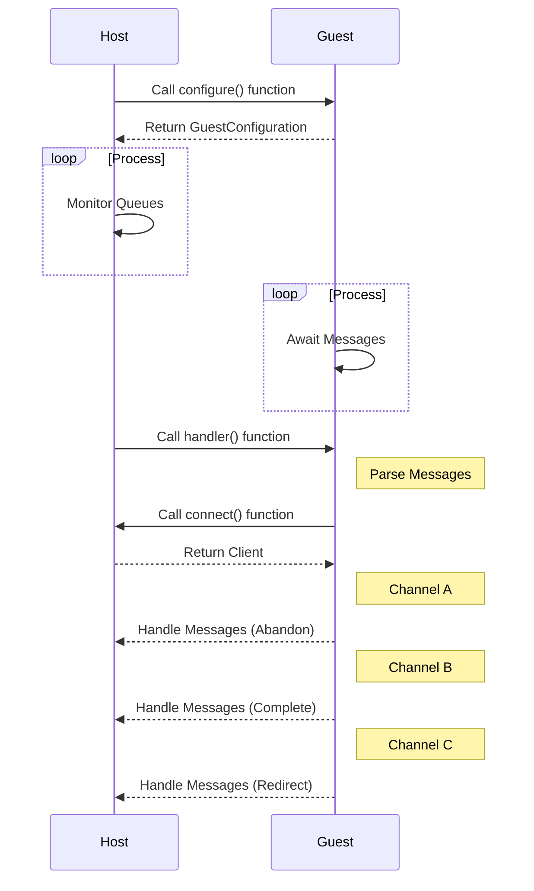

# WASI Messaging

This repository implements the WebAssembly System Interface (WASI) Messaging specification for Azure Service Bus using the Wasmtime runtime. The WASI Messaging specification provides a universal interface for WebAssembly modules to interact with message-oriented middleware, facilitating communication between WebAssembly modules and Azure Service Bus, a managed message broker for enterprise integration. Crafted in Rust, the implementation leverages Wasmtime, a standalone environment supporting WASI, to execute WebAssembly modules equipped with the WASI Messaging interface. The host is designed to manage multiple Azure Service Bus Queues concurrently, using a multi-threaded approach for processing of messages. The guest employs three channels — Abandon, Complete, and Redirect—to manage messages: Abandon for postponing message processing, Complete for successful processing, and Redirect for forwarding messages to different queues.

_Please note this repository is under development and subject to change._

