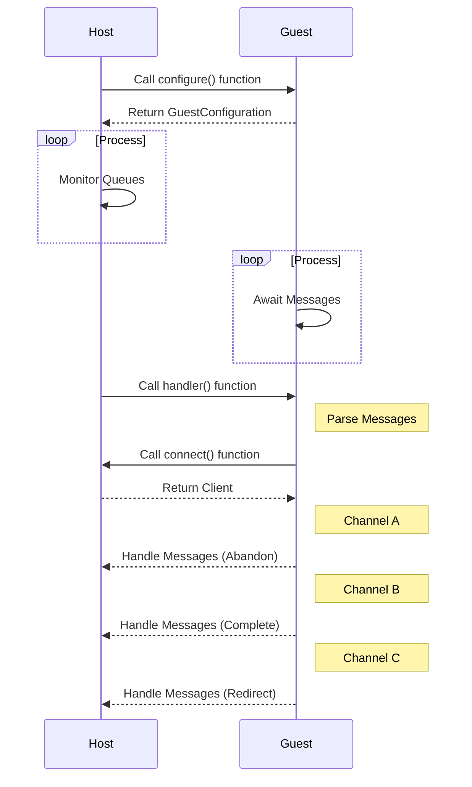

# WASI Messaging

This repository provides an implementation of the WebAssembly System Interface (WASI) Messaging specification, specifically tailored for Azure Service Bus, utilizing the Wasmtime runtime. The WASI Messaging specification outlines a universal interface for WebAssembly modules to communicate with message-oriented middleware. This project leverages this specification to facilitate interactions between WebAssembly modules and Azure Service Bus, a fully managed message broker for enterprise integration.

The implementation is crafted in Rust, taking advantage of the Wasmtime runtime, a standalone environment for executing WebAssembly modules that offers support for WASI. The Wasmtime runtime is responsible for running the WebAssembly modules and equipping them with the WASI Messaging interface.

In this setup, the host is engineered to concurrently manage multiple Azure Service Bus Queues. The host initially calls the configure() function to obtain the GuestConfiguration from the guest (WebAssembly module). This configuration, defined by the guest, includes the details of the channels that the guest will use to handle messages.

Once the configuration is obtained, the host spawns multiple worker threads, each tasked with overseeing a distinct channel (Queue) as defined in the GuestConfiguration.

Upon the arrival of messages in the Service Bus Queue, the worker thread triggers the handler() function on the guest. The guest subsequently parses the message and interacts with the host via the connect() function to establish a connection. The host responds by returning a Client which the guest employs to manage the messages.

The guest utilizes three channels to manage messages: Abandon, Complete, and Redirect. The Abandon channel is employed when the guest opts to postpone processing a message, returning it to the queue for future processing. The Complete channel is utilized when the guest has successfully processed a message, leading to its removal from the queue. The Redirect channel is employed when the guest decides to forward the message to a different queue for processing.

This multi-threaded strategy enables the host to efficiently oversee multiple Service Bus Queues and process messages concurrently, significantly enhancing the system's throughput and responsiveness.

_Please note this repository is under development and subject to change._

