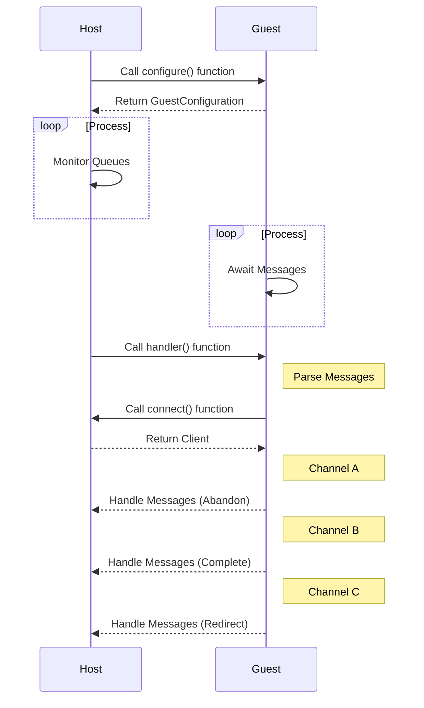

# WASI Messaging

_Please note this repository is under development and subject to change._

```mermaid
sequenceDiagram
    participant Host
    participant Guest

    Host->>Guest: Call configure() function
    Guest-->>Host: Return GuestConfiguration

    loop Process
        Host->>Host: Monitor Queues
    end

    loop Process
        Guest->>Guest: Await Messages
    end

    Host->>Guest: Call handler() function

    Note right of Guest: Parse Messages

    Guest->>Host: Call connect() function
    Host-->>Guest: Return Client

    Note right of Guest: Channel A
    Guest-->>Host: Handle Messages (Abandon)

    Note right of Guest: Channel B
    Guest-->>Host: Handle Messages (Complete)

    Note right of Guest: Channel C
    Guest-->>Host: Handle Messages (Redirect)
```
